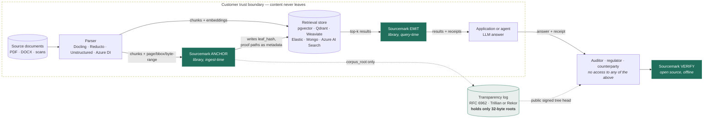
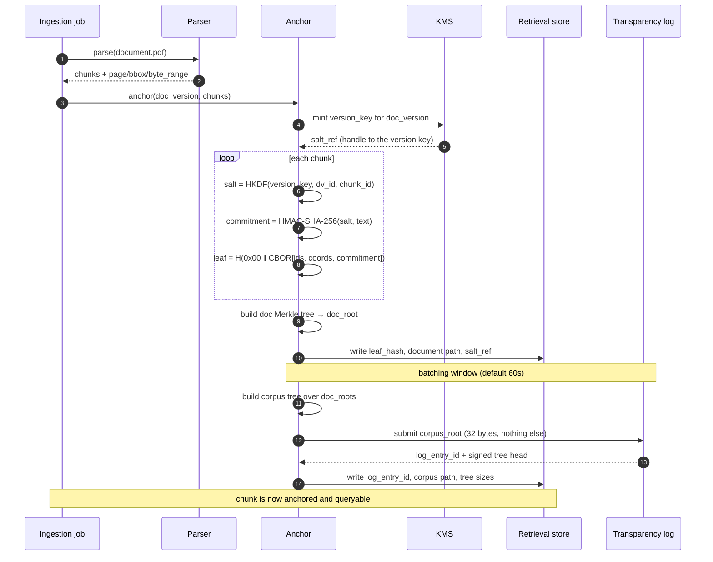
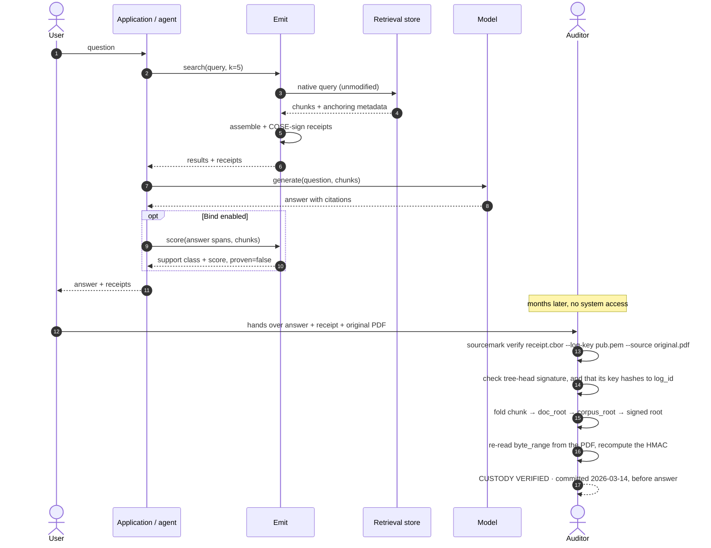
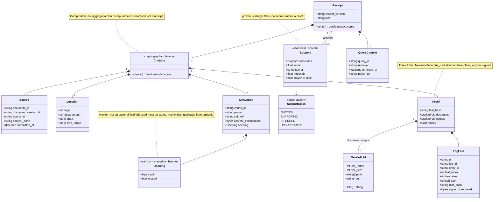
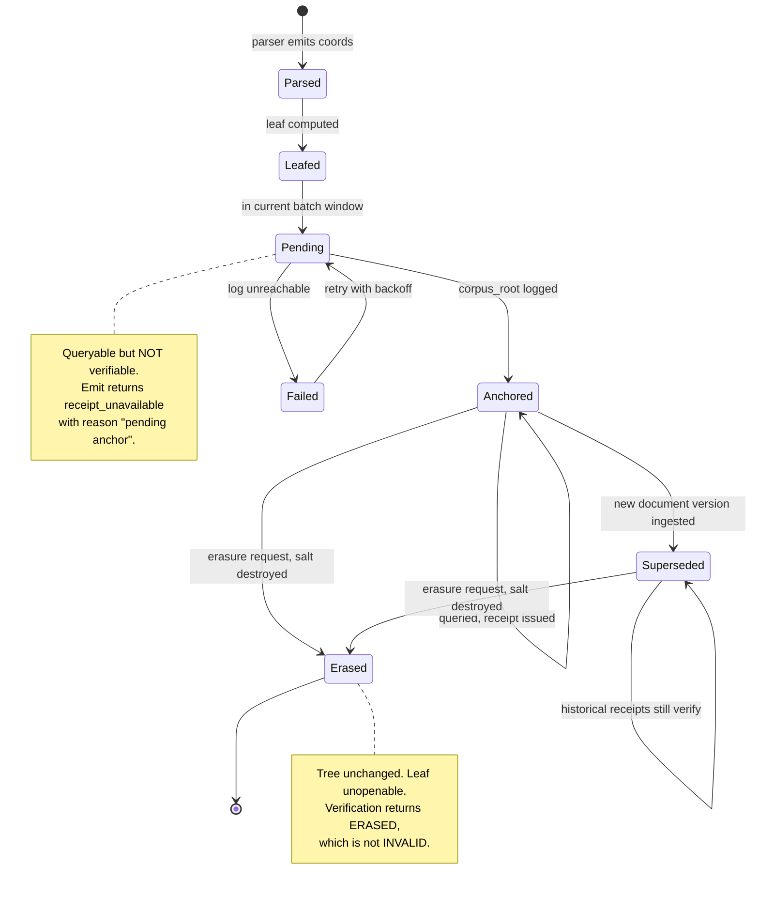
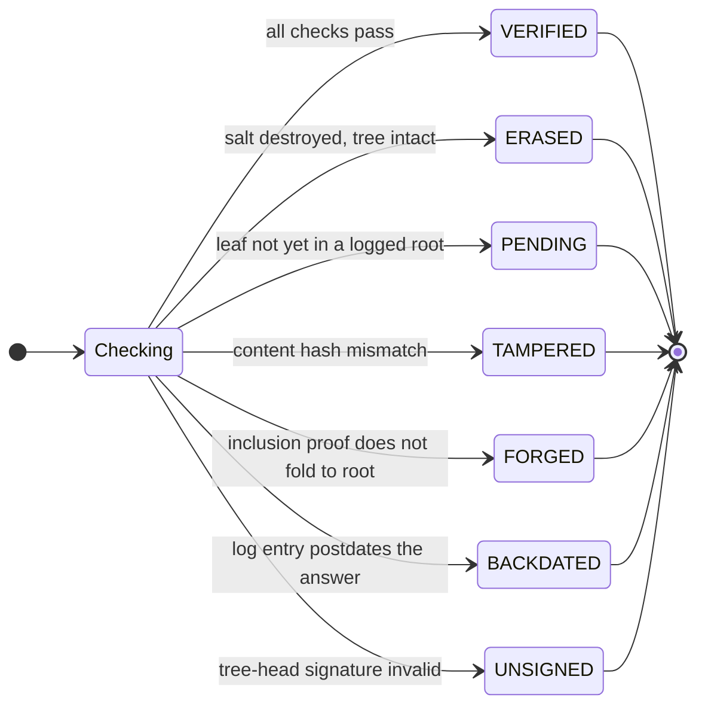
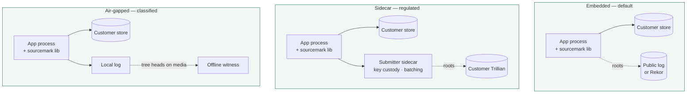
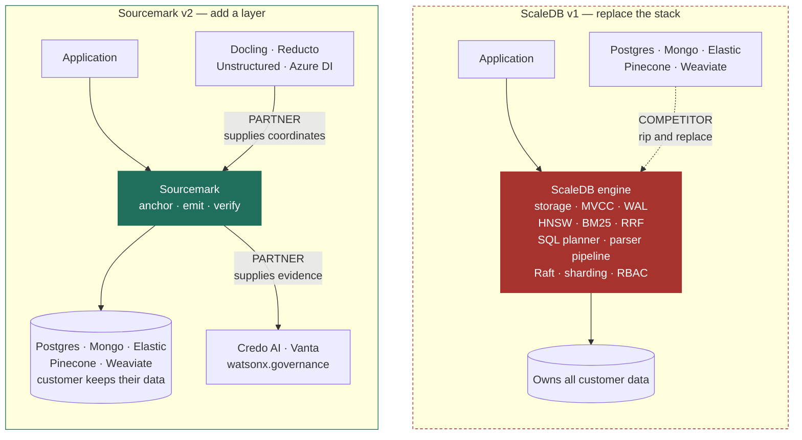

# Sourcemark — Architecture

All diagrams are Mermaid and render natively on GitHub. UML-style class, sequence, state, and deployment views follow the component views.

---

## 1. Where Sourcemark sits

The central claim of the architecture is what the dashed boundary shows: **customer content never crosses it.** Only Merkle roots leave.

The auditor verifies using only the receipt and a public key. Every arrow into `VERIFY` originates outside the system under audit — which is the entire point, and the property a database cannot have about itself.

---

## 2. Component view

```mermaid
flowchart TB
    subgraph SM["Sourcemark"]
        direction LR

        subgraph A["ANCHOR · ingest"]
            A1["Coordinate normalizer<br/>parser-specific adapters"]
            A2["Leaf builder<br/>HMAC commitment + CBOR coords"]
            A3["Merkle tree builder<br/>per document version"]
            A4["Batch submitter<br/>corpus root → log"]
            A5["Metadata writer<br/>store-specific adapters"]
            A1 --> A2 --> A3 --> A4
            A3 --> A5
        end

        subgraph E["EMIT · query"]
            E1["Retriever wrapper<br/>pass-through, no re-ranking"]
            E2["Receipt assembler"]
            E3["COSE signer<br/>C2PA manifest profile"]
            E4["Delivery<br/>SDK · HTTP header · MCP annotation"]
            E1 --> E2 --> E3 --> E4
        end

        subgraph B["BIND · optional"]
            B1["Span matcher<br/>QUOTED, deterministic"]
            B2["Entailment scorer<br/>SUPPORTED/INFERRED/UNSUPPORTED"]
        end

        subgraph V["VERIFY · offline, open source"]
            V1["Content binding check"]
            V2["Leaf reconstruction"]
            V3["Inclusion proof fold"]
            V4["Tree-head signature check"]
            V5["Ordering check<br/>commit precedes answer"]
            V6["Source re-derivation<br/>optional, needs original file"]
            V1 --> V2 --> V3 --> V4 --> V5 --> V6
        end
    end

    B --> E2
    A5 -.->|"metadata read back"| E1
    E4 -.->|"receipt travels with the answer"| V1

    style A fill:#f2f6f4,stroke:#1f6f5c
    style E fill:#f2f6f4,stroke:#1f6f5c
    style B fill:#faf7f2,stroke:#b4682f,stroke-dasharray: 4 3
    style V fill:#1f6f5c,color:#fff,stroke:#1f6f5c
```

`BIND` is drawn dashed and in a different hue because it is the only component producing a *scored* rather than a *proven* claim. That visual separation mirrors the data-model separation in `SPEC.md §5`.

---

## 3. Ingest sequence

The batching window is the one latency knob that matters: a chunk is not verifiable until its root is logged. Sixty seconds is the default; synchronous submission is available where a corpus is small or an SLA demands it.

---

## 4. Query and independent verification

Note what the auditor never does: contact the vendor, log into a console, or ask anyone to run a query. Every step after the handover is local arithmetic.

---

## 5. Receipt data model (UML class diagram)

`Support` is an aggregation and optional; `Custody` is a composition and mandatory. A Sourcemark receipt with no support score is still a valid receipt. A receipt with no custody proof is not a receipt at all — it is a citation, which is what we are replacing.

---

## 6. Chunk lifecycle (UML state diagram)

The distinction between `Failed` and `Pending` and between `Erased` and an invalid proof is the whole reliability story. A system that quietly returns a stub receipt in any of these states is worse than one with no receipts, because it converts an absence of evidence into false evidence.

---

## 7. Verification outcomes

Seven terminal outcomes, not two. `TAMPERED`, `FORGED`, `BACKDATED`, and `UNSIGNED` are distinct failures that point at different culprits — the storage layer, the receipt issuer, the timeline, and the log operator respectively. A boolean would hide which one occurred.

---

## 8. Deployment topologies (UML deployment view)

The same library binary serves all three. The topology changes who holds the log and the signing key, never what the customer has to install or how their retrieval works.

---

## 9. What changed from v1 — the architectural diff

Same underlying insight — provenance belongs at the retrieval layer — expressed as a component that every incumbent wants to buy rather than an engine every incumbent has to beat.

---

## 10. Scale envelope

| Dimension | Figure | Note |
|---|---|---|
| Storage overhead per chunk | 300–600 bytes | `leaf_hash` 32B, commitment 32B, document path ~20×32B at 1M chunks, coords. The corpus and log proofs are stored once per document version and once per batch, not per chunk; the salt is derived, not stored |
| Overhead on a 10M-chunk corpus | ~4–6 GB | In the customer's existing store, in existing columns |
| Anchor throughput | ~50k leaves/sec/core | SHA-256 bound; Merkle build is linear |
| Emit added latency | < 2 ms p95 | Metadata is already in the result row; signing is one Ed25519 op |
| Verify time | < 5 ms | ~20 hashes plus one signature check, offline |
| Bytes submitted to the log | 32 per batch window | Roots only |

The design is deliberately cheap on the hot path. Emit adds a signature, not a network call — anything that made query-time verification depend on log availability would have made retrieval less reliable in exchange for making it more provable, which is a bad trade nobody would take.
