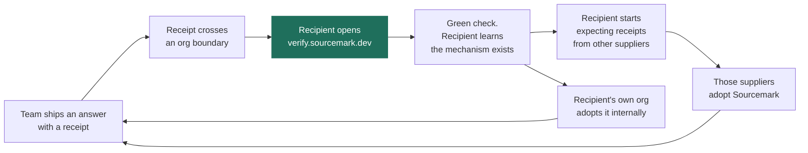

# Sourcemark — Licensing, repo split, and how this spreads

> Companion to [`ECOSYSTEM.md`](ECOSYSTEM.md). That document covers who we partner with; this one covers how the software is licensed, which parts are public, and the growth loop.
>
> **Prior art in this workspace:** `huma-protocol` already ships this architecture — Ed25519 over canonical JSON, an offline `verify` CLI, an Apache-2.0 SDK, a BUSL-1.1 engine, and a `.publicignore`-driven public/private repo split. The tooling is reusable verbatim. The *licensing posture* has to invert, and §2 explains why.

---

## 1. Licensing

| Component | License | Rationale |
|---|---|---|
| Receipt specification | **CC0 / public domain** | A format nobody may implement freely is not a standard. The spec spreading is the win. |
| `sourcemark-verify` — CLI, WASM, SDKs | **Apache-2.0** | Non-negotiable. The product claim is "you do not have to trust us." A verifier under any restrictive licence refutes the claim it exists to support. |
| `sourcemark` — anchor, emit, adapters | **Apache-2.0** | See §2. |
| Adapters, MCP server, integrations | **Apache-2.0** | These are the distribution surface. Any friction here kills the loop. |
| Hosted log with SLA, witness network, GRC connectors, enterprise support | **Commercial** | Operated services, not code. This is where revenue lives. |

Apache-2.0 rather than MIT specifically for the **patent grant** — it matters when proposing a profile to C2PA, and enterprise legal teams read it as the safer default.

---

## 2. Why not BUSL, given HUMA uses it

BUSL-1.1 is the right call for HUMA Scanner and the wrong call here, and the difference is what the moat is made of.

| | HUMA Scanner | Sourcemark |
|---|---|---|
| The moat | A private 25,836-address corpus — data that took months to accumulate | Adoption of a format, plus a transparency log's operating history |
| Effect of publishing the core | Hands a competitor months of free accumulation | **Creates** the moat; a format nobody implements is worthless |
| Realistic threat | Someone runs a hosted sybil-scoring service off your code and your corpus | Nobody. The code is a few thousand lines and trivially reimplementable |
| Who must adopt it | Operators scoring their own lists | LangChain, LlamaIndex, MongoDB, Reducto, auditors, regulators |

Four concrete costs of BUSL here:

1. **It blocks the integrations that are the entire growth loop.** LangChain and LlamaIndex will not take a BUSL dependency.
2. **It blocks the acquirers.** MongoDB and Elastic do not ship BUSL libraries inside their products. Restrictive licensing is not a moat against an acquirer, it is a wall against the acquisition.
3. **It contradicts the product.** Asking someone to trust a licence-restricted binary, in a product about not having to trust vendors, is a contradiction a sceptical auditor will notice.
4. **It protects nothing.** BUSL guards a data asset or a service business. Neither exists here.

**Where the open-core line actually sits:** everything in the reference implementation is Apache-2.0. Commercial licensing covers the *operated* pieces — a log with an availability SLA, a witness network, retention tooling, GRC connectors, support. Sell the operation, give away the mechanism.

---

## 3. Repo split

The `huma-protocol` machinery transfers directly and is genuinely good — `.publicignore` as a single source of truth, `stage-public-repo.sh` deriving from `git ls-files` minus patterns, `audit-pre-public.sh` as the gate, and the trick of `.publicignore` excluding itself so the list of private docs is not itself a roadmap.

What changes is the contents, and it is close to an inversion.

```
PRIVATE — advisely/sourcemark-protocol          the repository of record
  spec/ conformance/ sourcemark/ mcp/ docs/     everything technical
  strategy/ partners/ gtm/ ops/                 excluded by .publicignore
  scripts/  .publicignore                       the publishing machinery
  archive/                                      v1 artefacts, never published

        │  scripts/publish-public-repo.sh
        │    stage → audit → clone → audit again → commit → push
        ▼

PUBLIC — advisely/sourcemark                    derived, fresh history
  spec/ conformance/ sourcemark/ mcp/ docs/

PUBLIC — advisely/sourcemark-verify             split, its own history
  the verifier              CLI · WASM · GitHub Action   Apache-2.0
```

### Why the public repository is derived rather than flipped

The repository of record began life as ScaleDB v1 and its history still contains the v1 go-to-market, competitor and enterprise-readiness material — 1,602 lines of exactly what belongs in the private column. Making that repository public would publish all of it permanently, because a purge commit stops tracking a file, it does not delete it, and a fork cannot be un-forked.

There were three ways out. Rewriting history with `git filter-repo` destroys every hash and the "nothing was lost" property `PIVOT.md` depends on. Moving the material elsewhere and then rewriting has the same cost. Deriving a fresh public tree has neither: the repo of record keeps its history intact and private, and the public repository starts clean because it was never a copy of anything.

This is also the difference between a process and a property. "Remember not to publish the strategy directory" is a process, and processes are forgotten. A public tree that is generated from an explicit allowlist and gated by an audit that **fails closed** cannot leak what was never staged.

Publishing is one command, `scripts/publish-public-repo.sh`, and not three. Doing it by hand worked the first time and is exactly the thing that gets done from memory the second time, with the audit skipped because the diff "was only docs". The script stages into a scratch tree, audits it, copies it over a clone of the public repository, **audits again now that public history is attached** — so the history check runs against what is actually published rather than against an empty tree — and only then commits and pushes. Any failure at any point leaves the remote untouched, which is tested by planting a secret and confirming the published commit count does not move.

The public tree is replaced wholesale on each publish, because it is derived: a file that stops being staged must stop being published. Public history is preserved rather than force-pushed — for a provenance product, letting readers watch the format change over time is part of the argument.

`scripts/audit-pre-public.sh` refuses to publish on any of: a `.publicignore` path surviving staging, private-key or token material in staged content, a v1 artefact by name, prose that publishes a `git show <hash>:` retrieval path, a v1 artefact anywhere in the staged repository's history, or an internal link that does not resolve — since a dangling link is itself a map to what was removed. Each of those refusals is tested against a planted violation.

**Strategy, partners, GTM and ops live in the repo of record**, not in a fourth repository. `.publicignore` already excludes them, so a separate private repo would add a place to put something in the wrong one without adding any protection.

### Why the verifier is a separate repository, and why it was split before it was written

Three reasons, in descending order of how much they cost to get wrong.

1. **History.** Extracting it later means either rewriting hashes with `git filter-repo` or leaving the verifier's provenance behind in another repository. For the artifact whose entire pitch is that you need not trust the party that produced it — and which ships reproducible builds and Sigstore-signed releases *against that history* — retrofitting clean provenance onto a provenance product is a bad look. Splitting before the first line is written costs nothing and is unavailable afterwards.
2. **It makes the spec's acceptance criterion structural.** `spec/`'s gate is that a second implementer writes a working verifier from that directory alone. While the reference verifier sat in the same tree, "alone" was a promise. Now it is a repository boundary, and the gate is a thing you can fail rather than a thing you assert.
3. **Auditability.** *"Small enough to audit by hand"* is checkable about a repository containing only the verifier. It is not checkable about a monorepo, where a reader must first work out which parts they are being asked to trust.

The cost is one cross-repo CI job: `sourcemark-verify` must pass this repository's `conformance/` vectors at a pinned spec tag. That job exists now — `tests/fetch-vectors.sh` clones this repository at a ref and the suite refuses to run without it. Pinned rather than floating, because a verifier that silently follows `main` can be made to pass by editing the tests.

It has already earned its keep. The verifier shares no code with the emitter — its CBOR, its Merkle folding and its decision procedure are separate implementations written from `spec/` — and the first thing that boundary produced was a vector whose `byte_range` was 433 bytes long around 156 bytes of text. Every internal test passed; the file was simply never verified the strongest way. One repository would not have noticed.

`spec/` and `conformance/` stay together, and stay with `sourcemark/`. The vectors are not documentation *about* the format, they are its proof, generated by the same machinery that produces the worked examples; and `sourcemark/` emits the receipts those vectors describe, against the CDDL in the same tree. Splitting them would put one generator in two repositories.

**Nothing technical is private.** In HUMA, publishing the corpus destroys the business. Here, publishing everything technical *is* the business — a receipt format with a closed reference implementation is a proprietary blob, and nobody builds compliance evidence on a proprietary blob.

The one genuine secret is the **log signing key**, and that is an operational control, not a repository decision.

---

## 4. The growth loop

Sourcemark has a distribution mechanic that most infrastructure lacks, and it comes from a property of the artifact itself.

**A receipt is designed to leave the organization that produced it.** It goes to an auditor, a regulator, a contracting officer, opposing counsel, a customer. Every one of those people needs a verifier to act on it.



This is the `gpg --verify` / Certificate Transparency / npm-provenance-badge pattern. The demand side pulls the supply side: once one contracting officer has verified a receipt, every bidder to that officer needs one.

**The critical design constraint that follows:** the verifier has to be usable by someone who will never run `npm install`. Hence WASM at a URL, drag and drop, nothing uploaded, and a view-source page with an empty network tab. That page is more strategically important than the SDK.

### Concrete seeds, roughly in order of leverage

| Move | Why it works |
|---|---|
| **The tamper demo** — anchor a public corpus, edit one source, watch the verifier go red | Fifteen seconds, no slides, and it is the entire product |
| **`verify.sourcemark.dev`** — drag, drop, verdict, nothing uploaded | The surface used by non-customers, which is where the loop closes |
| **One PR each to LangChain and LlamaIndex** | Their reach, our five lines. Apache-2.0 makes this possible at all |
| **MCP server** | Every Claude Code / Cursor user gets receipts by editing one config block |
| **Publish the log's tree heads from day one** | A 2026 tree head cannot be manufactured in 2028. The log's age is the one asset nobody catches up to |
| **Conformance vectors + a second implementation** | A format with two implementations is a standard; with one it is a product |
| **Take the C2PA profile to the working group** | Membership, not a fork. Turns a startup into ecosystem infrastructure |

### Where the loop breaks, honestly

Provenance and crypto-verification projects have a large graveyard, and the cause of death is consistent: **nobody was ever forced to check.** If auditors keep accepting screenshots, no receipt is ever verified and the loop never turns.

There is also a chicken-and-egg: the verifier is useless without receipts, and receipts are worthless without verifiers.

**Mitigation — seed only where the recipient is already adversarial.** Federal contracting officers, external auditors, notified bodies, opposing counsel in discovery. Those people already check things and already distrust the sender. Do not seed in internal Q&A, where nobody has a reason to verify anything and the artifact dies unopened.
