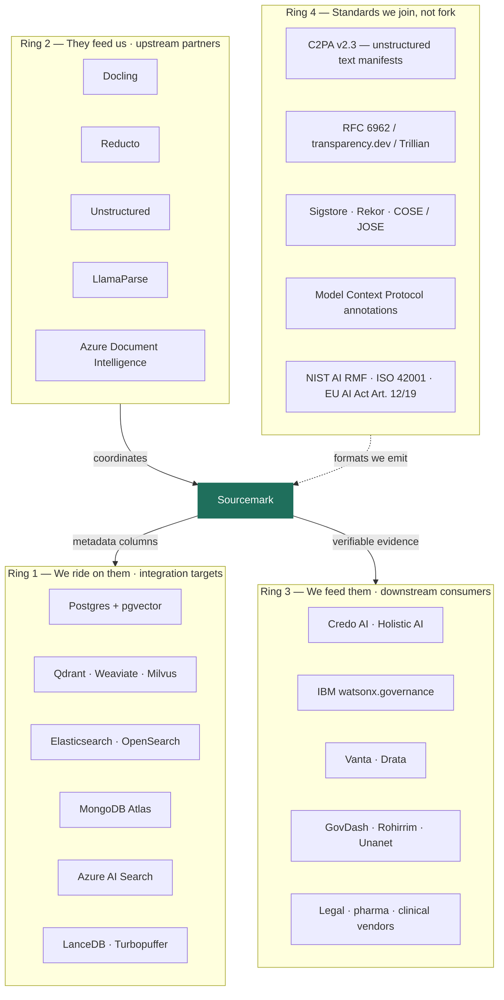

# Sourcemark — Ecosystem Position

> The v1 document set had an `APPENDIX_COMPETITORS.md` with parity tables against Postgres, MongoDB, Pinecone, Weaviate, Neo4j and SurrealDB. This document replaces it. Almost every name on that list moved from the competitor column to the partner column, and that move is the strategy.

---

## 1. The rule

**Sourcemark never competes for the data plane.**

Any capability that would require holding customer content, serving customer queries, or replacing an incumbent engine is out of scope by construction — see `SPEC.md §10`. What remains is a layer that makes someone else's engine more valuable, which is the only kind of company the engine vendors buy rather than fight.

---

## 2. The four rings

---

## 3. Ring 1 — Retrieval stores we ride on

These were the v1 competitor list. Postgres decisively won the vector-store consolidation in 2026 — pgvectorscale benchmarks put it an order of magnitude ahead of standalone engines at mid scale, Elastic's leadership publicly called vector search "a feature," and the standalone vendors are consolidating. Competing with that was the central v1 error.

**What we ship per store:** an adapter of roughly 200 lines that writes five metadata fields at ingest and reads them back at query time. No fork, no plugin, no privileged access.

| Store | Metadata mechanism | Effort |
|---|---|---|
| Postgres + pgvector | `bytea` + `jsonb` columns on the chunk table | Reference adapter |
| Qdrant | Point payload fields | Small |
| Weaviate | Object properties | Small |
| Elasticsearch / OpenSearch | Document fields, `index: false` | Small |
| MongoDB Atlas | Subdocument on the chunk | Small |
| Azure AI Search | Non-searchable fields | Small |

**The pitch to the vendor:** your customers are being asked for EU AI Act Article 12 evidence and your engine cannot produce it, because a store that can silently update a row cannot attest to its own history. We add that in a library. You keep the workload.

---

## 4. Ring 2 — Parsers that feed us

Sub-document coordinates are table stakes in the parsing layer as of 2026: Reducto returns per-block and per-chunk bounding boxes plus per-field citations, Unstructured returns element coordinates, LlamaParse does bbox layout extraction, and Azure Document Intelligence and Textract return bbox with confidence.

The v1 docs claimed "lineage to page/paragraph/bounding box — nearest alternative: **None**." That was already wrong when written. But it is wrong in a *useful* direction: those coordinates are precisely the input Sourcemark needs, and four vendors are competing to produce them well and give them away.

**We do not parse. We commit to what parsers emit.** Every improvement in that layer is a free improvement to ours.

**The pitch to the vendor:** you produce the coordinates; nobody makes them provable. Ship Sourcemark in your SDK and your output stops being metadata and starts being evidence.

---

## 5. Ring 3 — Platforms we feed

This is where revenue enters, because these are the people whose customers are being asked hard questions.

| Segment | What they have | What they lack | What we give them |
|---|---|---|---|
| AI governance (Credo AI, Holistic AI, watsonx.governance) | Policy packs, risk registers, evidence workflows aligned to EU AI Act / NIST AI RMF / ISO 42001 | The evidence they collect is self-reported and silently mutable | Evidence with an inclusion proof, verifiable by the regulator without them |
| Compliance automation (Vanta, Drata) | Continuous control monitoring, auditor relationships | No AI-specific decision evidence | A control that emits verifiable artifacts |
| Proposal / bid intelligence (GovDash, Rohirrim, Unanet+GovPro, GovEagle) | The workflow, the users, the federal channel | Every generated volume is an unverifiable assertion to a contracting officer | Per-claim receipts a CO can check offline |
| Regulated verticals (legal e-discovery, pharma regulatory, clinical) | Domain workflow and trust | Chain of custody breaks the moment an LLM touches the document | Custody that survives the LLM |

Note the deliberate reversal on proposal intelligence. The v1 GTM made it the flagship *product*, which put it head-on against four funded, shipping vendors with federal channels — Unanet had already acquired GovPro AI. In v2 those vendors are the customer. Their product plus our receipts is a story none of them can build alone, and it turns their sales team into ours.

---

## 6. Ring 4 — Standards we join

Every one of these is a decision *not* to invent something.

| Standard | What we do with it | What we refuse to do |
|---|---|---|
| **C2PA v2.3** — added manifests for unstructured text in Dec 2025, explicitly to cover LLM outputs; 6,000+ members; referenced by EU AI Act Art. 50 and California SB 942 | Emit receipts as a C2PA assertion so existing verifiers parse the envelope | Invent a proprietary bundle format |
| **RFC 6962 / Trillian / transparency.dev** — the Certificate Transparency lineage | Use as the log, unmodified; support customer-hosted instances | Build a bespoke append-only log |
| **Sigstore / Rekor / COSE** | Signing and optional public log; Sigstore-signed releases of the verifier | Roll our own signing envelope |
| **MCP annotations** — resource links already carry provenance metadata | Deliver receipts inside the annotation any MCP host already reads | Define a competing agent protocol |
| **EU AI Act Art. 12 / 19, NIST AI RMF, ISO 42001** | Map receipt fields to specific obligations; publish the mapping | Claim to *be* compliance |

The strategic value: a startup that contributes a profile to C2PA and an adapter to Trillian is a member of an ecosystem. A startup with its own format and its own log is a vendor asking for trust, which is a contradiction in a product about not having to trust vendors.

---

## 7. The acquisition thesis

You asked to build something an incumbent would rather buy than fight. That is a set of design constraints, and they are already in the spec.

**What makes an infrastructure company hard to acquire:** it holds customer data, so acquisition means migration; it competes with a business unit, so acquisition means cannibalization; its value is in an engine, so the acquirer must decide whose engine dies.

**Sourcemark has none of those properties, by construction:**

| Constraint | Consequence for an acquirer |
|---|---|
| No data plane — we never hold customer content | Nothing to migrate. Integration is a dependency, not a project. |
| No engine — we do not index, plan, or rank | No overlap with any acquirer's core product. Nothing gets killed. |
| Library-shaped — adapters, a signer, a verifier | Absorbs into an existing SDK in a quarter |
| Open-source verifier + published spec | The trust asset survives the acquisition; customers do not churn on the news |
| Standards-aligned | The acquirer inherits a seat at C2PA, not a fork to maintain |
| Compliance-shaped value | Lands as a checkbox on their enterprise tier, priced immediately |

**Plausible acquirers, and the specific thing they buy:**

- **MongoDB, Elastic, Databricks, Snowflake, Oracle** — "our vector search is EU AI Act Article 12 ready" on an enterprise tier, without a crypto team
- **Reducto, Unstructured, LlamaIndex** — their coordinates become evidence, moving them up the value chain from parsing to assurance
- **Vanta, Drata, Credo AI** — the first verifiable artifact in a category built entirely on self-attestation
- **Adobe, Microsoft** — deep C2PA investment already; text-provenance is the missing surface
- **Palantir, Accenture, Deloitte** — regulated-deployment assurance as a service line

**The honest caveat:** designing for acquisition and designing for a durable independent business diverge at exactly one point — pricing power. A layer that is easy to absorb is also easy to reimplement once the pattern is proven. The defense is not the code, which is a few thousand lines. It is (a) being the published profile everyone else has to interoperate with, (b) the log's operating history, since a transparency log's value is monotonic in its age and nobody can retroactively manufacture a 2026 tree head, and (c) design-partner receipts already sitting in regulators' hands. All three compound with time and none of them can be cloned. **Ship the spec and start the log early, because the log's first entry is the one asset that cannot be caught up to.**

---

## 8. Who is actually in this space

Being precise about this is more useful than a parity table.

| Player | What they attest | Gap we occupy |
|---|---|---|
| Veridra | Cryptographic evidence per AI *decision*; controlled alpha | Decision-level. Does not bind to source coordinates. |
| EQTY Lab | AI Integrity Suite, Verifiable Runtime; shipping with Intel, NVIDIA, Accenture, Hedera | Runtime and lifecycle attestation. Attests the compute, not the citation. |
| VeriTrace, agent-receipts, LedgerProof | Open-source signed receipts for AI decisions / file existence | Output-level signing. No retrieval lineage. |
| Research: Proof-Carrying Answers, VeriRAG, Policy-Checked RAG, ContextNest, SAG | Exactly our problem, well-formulated | All prototypes. None productized. |
| Governance platforms (Credo AI, watsonx.governance, Vanta) | Evidence collection and workflow | Evidence is mutable and self-reported |

**The shape of the opportunity:** a category is forming at the *decision* layer and nobody has claimed the *retrieval* layer beneath it. Everything above attests "the model said this." Nothing attests "and this is genuinely where it came from."

**The shape of the risk:** the research is converging fast and the adjacent products are funded and shipping. The window before someone reaches down into retrieval — or a parser vendor reaches up into attestation — is realistically twelve to eighteen months. That is the argument for a Phase 0 measured in weeks. See [`ROADMAP.md`](ROADMAP.md).
